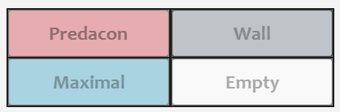
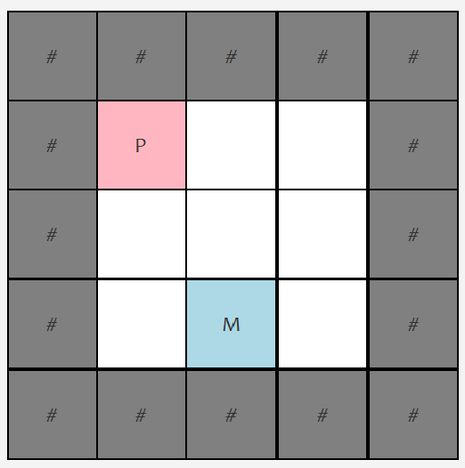

# CPSC233A3 Robot Wars World Map Editor

---

- [Overview](#project-overview)
- [Running the Program](#running-the-program)
- [Creating a World Map](#creating-a-world-map)
- [Editing a World Map](#editing-a-world-map)
- [Saving a World Map](#saving-a-world-map)

---

## Project Overview

This application is a world map editor for a Robot War simulation.  The world 
map consists of a grid with m rows and n columns where each grid square can 
be in exactly one of the following states:

By default, the map is padded with a perimeter of walls to represent the world
boundaries.

> **Notes:** This perimeter wall is a view-only feature.  Therefore, it cannot
> be edited, should not be counted in coordinate calculations, and will not be
> be saved in the world map data. (See [Saving a World Map](#saving-a-world-map)

For our coordinate system we will use the convention `(row,col)` where `row` is
the y-coordinate and `col` is the x-coordinate.
- Rows are numbered from top to bottom in increasing order, starting from `0`.
- Columns are numbered from left to right in increading order, starting from `0`.
- Perimeter walls are not counted in coordinates.

For instance, the example below represents a `3 x 3` world with a PredaCon in 
coordinate `(0,0)` and a Maximal in coordinate `(2,1)`.

To obtain more information about the entity in a world map square, one may hover
over the desired square.  

## Running the Program

- Website link
- Download java fx
- Command line arguments
- Run in terminal/GUI options
- Running `.jar` file

## Creating a World Map
## Editing a World Map

## Saving a World Map