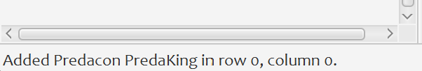
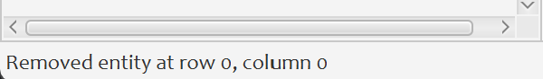

# CPSC233A3 Robot Wars World Map Editor

---

- [Overview](#project-overview)
- [Running the Program](#running-the-program)
- [Creating a World Map](#creating-a-world-map)
- [Editing a World Map](#editing-a-world-map)
- [Saving a World Map](#saving-a-world-map)

---

## Project Overview

This application is a world map editor for a Robot War simulation.  The world map consists of a grid with `m` rows and 
`n` columns where each grid square can be in exactly one of the following states:


By default, the map is padded with a perimeter of walls to represent the world boundaries.

> **Notes:** This perimeter wall is a view-only feature.  Therefore, it cannot be edited, should not be counted in 
> coordinate calculations, and will not be be saved in the world map data. (See [Saving a World Map](#saving-a-world-map)

For our coordinate system we will use the convention `(row,col)` where `row` is the y-coordinate and `col` is the x-coordinate.
- Rows are numbered from top to bottom in increasing order, starting from `0`.
- Columns are numbered from left to right in increading order, starting from `0`.
- Perimeter walls are not counted in coordinates.

For instance, the example below represents a `3 x 3` world with a PredaCon in coordinate `(0,0)` and a Maximal in coordinate `(2,1)`.


To obtain additional information about the entity in a world map square, one may hover over the desired square.  

## Running the Program

### Running the World Editor
In order to run this program you need to have the JavaFX SDK 21.0+ installed in your machine 
([download link](https://gluonhq.com/products/javafx/)) and Java SDK 21.0+ ([download link](https://jdk.java.net/21/)).  
Please keep in mind the location where JavaFX is installed as it will be needed in the following steps:

1. Download project files.
2. Open your command line and navigate to the `CPSC233A3\target\classes` directory.
3. Run the following command, replacing `"C:\ProgramFiles\Java\javafx-sdk-21.0.1.lib"` with the location of your local JavaFX install:
```bash
java --module-path "C:\ProgramFiles\Java\javafx-sdk-21.0.1.lib" --add-modules javafx.controls, javafx.fxml rw.app.Main
```
4. Alternatively, if you are running the program using a `.jar` file, you can run the following command:
```bash
java --module-path "C:\ProgramFiles\Java\javafx-sdk-21.0.1.lib" --add-modules javafx.controls, javafx.fxml -jar CPSC233A3.jar
```

### Running the Game
The actual game does not have a GUI at the moment.  However, if you want to see the robots have an actual battle in the
world you created, you can run the command line version of the game using the following command:

```bash
java --module-path "C:\ProgramFiles\Java\javafx-sdk-21.0.1.lib" --add-modules javafx.controls, javafx.fxml rw.shell.Main battle.txt log.txt 12345
```

where:
- `battle.txt` should be replaced with the file containing the world map you wish to use in the game.
- `12345` should be replaced with the seed you wish to use to control the randomness used in the game.

## Creating a World Map

By default, the application will load an empty 3x3 map.  You can create your own world map by entering desired dimensions 
in the Master tab, under the World section.

>Note: World dimensions must be non-negative integers.  Failure to enter the correct format in either filed will trigger
> a warning in the status bar at the bottom of the page.


Alternatively, you can load in a pre-defined world from a `.txt` file on your machine using File > Load World menu option.
Note however that the `.txt` file must be of the specified format.

## Editing a World Map

### Adding Entities

Entities in a world map can be added using the Master tab.  Failure to provide the correct format in any of the fields 
will trigger a warning in the status bar at the bottom of the page.


After an entity has been successfully added, the status bar will display the name and location of the new entity.



### Removing Entities

To remove an entity, simply right click its position on the grid.  After an entity has been successfully deleted, the 
status bar will display the location where the entity was removed.



## Saving a World Map

All the edits made in the Program UI can be saved to a `.txt` file of the specified format to be loaded into the game.
- The File > Save option saves the world map to the default `world.txt` file.
- The File > Save As... option prompts you to choose a location as to where to save the file and what you wish to name it.

If file was saved successfully, the status bar will report the location of the saved file.

